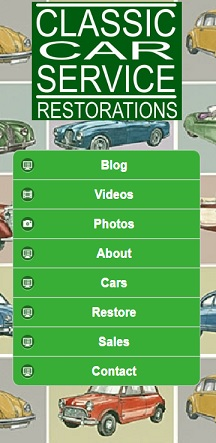

**#Mobile Website**

**Language:** PHP, HTML

**Description:** The first Web Development project was to build a creative Website, the second project was to use that same Website to build a user friendly mobile application. I used my Classic Cars Website with all same content for this mobile application. The design and look is completely different but uses HTML, CSS, Javascript, XML, Json and Jquery for mobile. I have provided a link to the mobile website but also a version of this site as Android APK which can be downloaded and viewed offline. This Android APK was created with Android Studio and contains all the functionality of the online site.
